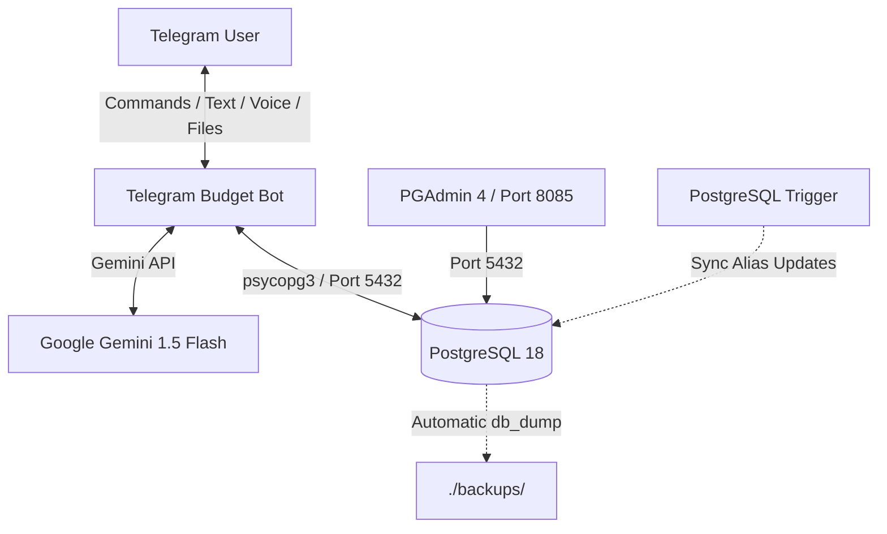

# 💰 My Family Budget Bot

[](https://github.com/shdrn2402/my_family_budget/actions/workflows/deploy.yaml)
[](https://www.python.org/downloads/)
[](https://docs.astral.sh/uv/)
[](https://www.postgresql.org/)
[](https://ai.google.dev/)

**My Family Budget** is a private, bilingual (English/Russian) Telegram bot designed for family finance tracking. It combines LLM-powered natural language processing, voice transcription, and structured database synchronization.

---

## ⚙️ System Architecture



---

## ✨ Core Features

*   🎙 **Voice-to-Text Parsing:** Records expenses from voice messages by transcribing audio via Gemini 1.5 Flash, then maps details into structured transactions (item, account, amount, category).
*   💬 **Smart Natural Language Entry:** Processes free-form text (e.g., *"spent 500 on coffee yesterday in cash and 2k on fuel with credit card"*) to log multiple transactions at once.
*   ⏳ **Debounced Batch Statement Loading:** Groups multiple statement uploads (Excel/XLSX) sent in a single batch, processes them in one operation, and outputs a single aggregated report to avoid message spam.
*   🗃 **Database-Level Alias Synchronization:** Uses a PostgreSQL trigger (`trg_update_item_alias`) on transaction category updates. Modifying a transaction's category automatically synchronizes or inserts the corresponding pattern in `item_aliases` to categorize future statements correctly.
*   🤖 **Bilingual Interface:** Supports dynamic runtime localization (English/Russian) through a centralized translation system (`bot/texts.py`).
*   🔒 **Access Control Whitelist:** Restricts access to predefined Telegram User IDs with granular admin flags (`is_admin`).

---

## 🛠 Tech Stack & Port Mapping

| Service | Technology | Port (Host:Container) | Description |
| :--- | :--- | :--- | :--- |
| **Bot Ingestion** | Python 3.12 + `uv` | *N/A (Stateless)* | Telegram webhook/polling daemon |
| **Database** | PostgreSQL 18 | `5433:5432` | Primary transactional storage |
| **Database Admin** | PGAdmin 4 | `8085:80` | Web interface for database management |
| **LLM Engine** | Gemini 1.5 Flash | *API* | Voice transcription and entity extraction |

---

## 🔄 CI/CD & Production Deployment

The project features a fully automated CI/CD pipeline configured via GitHub Actions (`deploy.yaml`).

### Pipeline Stages
1.  **Run Tests:** Automatically provisions a runner, restores dependencies using cached Astral `uv`, and executes unit tests via `pytest`.
2.  **Build and Push:** Compiles the Docker image and pushes it to the GitHub Container Registry (`ghcr.io/shdrn2402/my_family_budget/budget_bot:latest`).
3.  **VPS Deploy:** Connects to the DigitalOcean VPS via SSH:
    *   Creates an automatic pre-deployment database dump inside `./backups/` to prevent data loss.
    *   Regenerates the local `.env` configuration file from GitHub Secrets.
    *   Pulls the updated repository code.
    *   Launches services using `docker compose` in detached mode.

> [!NOTE]
> Pushes containing the tag `[skip ci]` in their commit message bypass the CI/CD pipeline execution.

---

## 🚀 Setup & Local Development

### 1. Configure Environment Variables
Create a `.env` file in the root directory (based on `env.example`):
```env
TELEGRAM_TOKEN="your_telegram_bot_token"
ALLOWED_USER_IDS="your_allowed_telegram_user_ids"
DB_HOST="pgdatabase"
DB_PORT=5432
DB_NAME="budget"
DB_USER="budget_user"
DB_PASSWORD="your_db_password"
PGADMIN_DEFAULT_EMAIL="your_pgadmin_email"
PGADMIN_DEFAULT_PASSWORD="your_pgadmin_password"
GEMINI_API_KEY="your_gemini_api_key"
```

### 2. Running Locally with Docker
Ensure Docker and Compose are installed, then run:
```bash
docker compose up -d --build
```
On startup, the bot automatically checks if the database is initialized. If not, it attempts to restore the schema from the latest SQL file in `backups/` or falls back to running `scripts/schema.sql` and `scripts/seed_data.sql`.

### 3. Running Locally without Docker (for debugging)
Install Astral `uv` and run:
```bash
uv sync
uv run pytest     # Run tests
uv run main.py    # Start the bot
```

### 4. Syncing Production Data to Local
To fetch the latest production backups for local debugging, execute:
```bash
./scripts/sync_db.sh
```
*Note: This script downloads backup dumps from the production VPS and automatically spins up a local database pre-populated with actual data.*

---

## 📅 Roadmap & Backlog
*   Check [ROADMAP.md](./docs/ROADMAP.md) for completed phases and upcoming ergonomic improvements.
*   Check [BACKLOG.md](./docs/BACKLOG.md) for future project architecture ideas.
