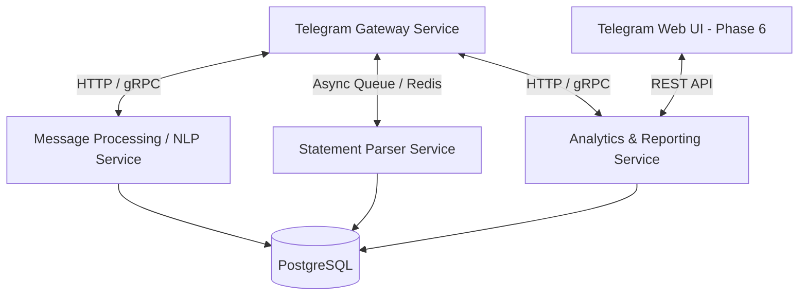

# Proposal: Microservices Architecture & Analytics Service Extraction

## 1. Overall System Architecture & Service Decomposition

### Microservices Breakdown:

1. **Telegram Gateway Service:**
   - **Responsibilities:** Receives Telegram updates (Polling/Webhook), handles authentication, routes user requests to internal services, handles response formatting and UI menus.
   - **Dependencies:** Minimal (`python-telegram-bot`, HTTP/gRPC client).

2. **Message Processing / NLP Service:**
   - **Responsibilities:** Text and voice parsing, LLM entity extraction (amount, category, account), category/alias matching against DB.

3. **Statement Parser Service:**
   - **Responsibilities:** Processes heavy bank statements (PDF, XLSX), deduplication logic, batch transaction matching. Isolates heavy dependencies (`pandas`, `pdfplumber`, `openpyxl`) from the main gateway.
   - **Execution Mode:** Asynchronous (via Redis/RabbitMQ queue).

4. **Analytics & Reporting Service:**
   - **Responsibilities:** NL2SQL query processing, data aggregations, Plotly chart generation, PDF report generation.
   - **Value:** Serves as a single REST API point of access for both Telegram Bot and future Telegram Web App (Phase 6).

---

## 2. Analytics & Reporting Service Scope

### A. Automatic Push Reports (Scheduled / Telegram Bot)
Generated by server background jobs:
1. **Monthly Executive Summary (PDF Report):**
   - Total income, expenses, and net delta for the month.
   - Breakdown chart by top-level categories (Plotly).
   - AI Executive Summary from Gemini (anomalies, month-over-month comparison).
2. **Alerts & Thresholds:**
   - Budget threshold breach notifications by category.

### B. Interactive Pull Requests (Telegram Bot Interface)
Requested on-demand by user via chat:
1. **Natural Language to SQL (NL2SQL):** Freeform user questions ("How much was spent on groceries in the last 2 weeks?") -> safe SQL generation -> textual response with mini chart.
2. **Quick Statistics (`/stats`):** Interactive menu rendering distribution charts for current/previous month.

### C. Online Dashboard (Phase 6 / Web App API)
REST API endpoints for Telegram Web App frontend:
1. `GET /api/v1/analytics/summary?period=month` — Aggregated income/expense metrics.
2. `GET /api/v1/analytics/trends` — Expense trends over time (Time Series).
3. `GET /api/v1/analytics/categories` — Hierarchical category breakdown.
4. `GET /api/v1/analytics/pending` — List of transactions needing manual reconciliation.

---

## 3. Step-by-Step Technical Implementation Plan

1. **Service Structure:**
   - Create isolated `analytics_service/` directory with a FastAPI application.
   - Dedicated `Dockerfile` and service entry in `compose.example.yaml`.
2. **API Contracts (OpenAPI/Pydantic):**
   - Define REST endpoints for text summaries, PNG charts, and PDF files.
3. **Refactoring & Extraction (TDD):**
   - Extract NL2SQL pipeline, Plotly chart builder, and HTML/PDF generator into `analytics_service/`.
   - Write unit and integration tests for the analytics API.
4. **Telegram Gateway Integration:**
   - Replace internal module calls in the bot with HTTP requests (`httpx`) to `http://analytics_service:8000`.
